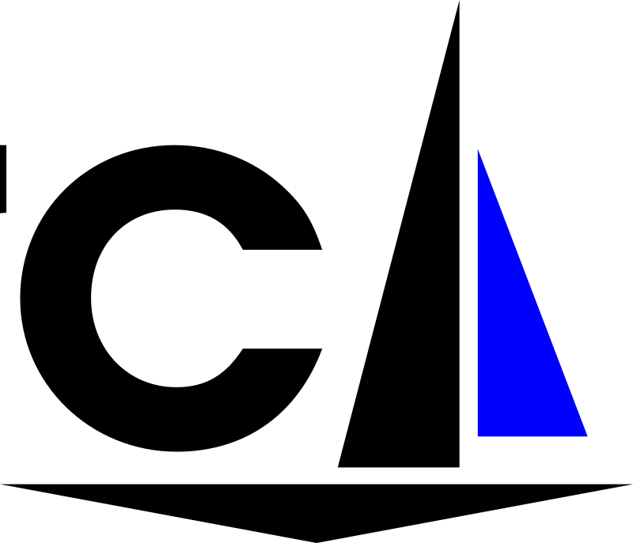

This Snakemake pipeline implements the [GATK best-practices workflow](https://software.broadinstitute.org/gatk/best-practices/workflow?id=11145) for calling small genomic variants.

It's based on [this workflow](https://github.com/snakemake-workflows/dna-seq-gatk-variant-calling/releases) by Johannes Köster.

## Authors

* Elena Piñeiro
* Tomás Di Domenico

## Usage

### Simple

#### Step 1: Install workflow

If you simply want to use this workflow, clone the repository or download its source code.
If you intend to modify and further extend this workflow or want to work under version control, fork this repository as outlined in [Advanced](#advanced). The latter way is recommended.

In any case, if you use this workflow in a paper, don't forget to give credits to the authors by citing the URL of this repository and, if available, its DOI (see above).

#### Step 2: Configure workflow

Configure the workflow according to your needs via editing the files `config.yaml`, `contigs.tsv`, `samples.tsv` and `units.tsv`.

**config.yaml**

This file contains the paths to files required in the analysis, the enabling/disabling of optional steps, as well as additional parameters for some of the programs used in the process.

The file is structured in several sections to be customized according to the characteristics of the analysis. The indications for its filling are provided inside the file.

**contigs.tsv**

It contains the contigs of the reference genome to include in the analysis (one contig per line). If empty, the analysis is performed using all contigs in the fasta index.

**samples.tsv**

It lists all samples to be included in the run, the group to which the samples belong, the use of MuTect2 and its execution mode.

HaplotypeCaller will be executed for each sample in the `sample` column. The results of the samples from each `group` will be merged, and consequently, at the end, there will be one HaplotypeCaller result for each `group` defined in this file.

Mutect will always be run independently for each tumor sample or tumor/control pair, and its results will remain separated. To activate the execution of MuTect2 and set its execution mode, the `control` column is used. If control contains:

- `-` MuTect2 is not executed for that sample.

- The same sample name as in the `sample` column: MuTect2 is executed for that sample in tumor-only mode.
- A different sample name than in the `sample` column: MuTect2 is executed in tumor-normal mode; being the tumor sample the one indicated in the `sample` column, and the normal sample the one indicated in the `control` column.

Examples:

- No MuTect2 execution:

|group | sample | control |
| ------ | ------ | ------ |
| 1 | A | - |

- MuTect2 execution in tumor-only mode:

|group | sample | control |
| ------ | ------ | ------ |
| 1 | A | A |

- MuTect2 execution in tumor-normal mode:

| group | sample | control |
| ------ | ------ | ------ |
| 1 | A | B |
| 1 | B | - |

being A:tumor, B:normal

**units.tsv**

It contains the specifications of the samples (sequencing units, sequencing platform and fastq files) listed in `samples.tsv`, as described in the original workflow ([Step3: configure workflow](https://snakemake.github.io/snakemake-workflow-catalog/?usage=snakemake-workflows%2Fdna-seq-gatk-variant-calling)).

#### Step 3: Execute workflow

Test your configuration by performing a dry-run via

    snakemake --use-conda -n

Execute the workflow locally via

    snakemake --use-conda --cores $N

using `$N` cores or run it in a cluster environment via

    snakemake --use-conda --cluster qsub --jobs 100

or

    snakemake --use-conda --drmaa --jobs 100

If you not only want to fix the software stack but also the underlying OS, use

    snakemake --use-conda --use-singularity

in combination with any of the modes above.
See the [Snakemake documentation](https://snakemake.readthedocs.io/en/stable/executable.html) for further details.

# Step 4: Investigate results

After successful execution, you can create a self-contained interactive HTML report with all results via:

    snakemake --report report.html

This report can, e.g., be forwarded to your collaborators.
An example, using some trivial test data, can be seen [here](https://cdn.rawgit.com/snakemake-workflows/dna-seq-gatk-variant-calling/master/.test/report.html).

### Advanced

The following recipe provides established best practices for running and extending this workflow in a reproducible way.

1. [Fork](https://help.github.com/en/articles/fork-a-repo) the repo to a personal or lab account.
2. [Clone](https://help.github.com/en/articles/cloning-a-repository) the fork to the desired working directory for the concrete project/run on your machine.
3. [Create a new branch](https://git-scm.com/docs/gittutorial#_managing_branches) (the project-branch) within the clone and switch to it. The branch will contain any project-specific modifications (e.g. to configuration, but also to code).
4. Modify the config, and any necessary sheets (and probably the workflow) as needed.
5. Commit any changes and push the project-branch to your fork on github.
6. Run the analysis.
7. Optional: Merge back any valuable and generalizable changes to the [upstream repo](https://github.com/snakemake-workflows/dna-seq-gatk-variant-calling) via a [**pull request**](https://help.github.com/en/articles/creating-a-pull-request). This would be **greatly appreciated**.
8. Optional: Push results (plots/tables) to the remote branch on your fork.
9. Optional: Create a self-contained workflow archive for publication along with the paper (snakemake --archive).
10. Optional: Delete the local clone/workdir to free space.

## Testing

Tests cases are in the subfolder `.test`. They are automtically executed via continuous integration.
